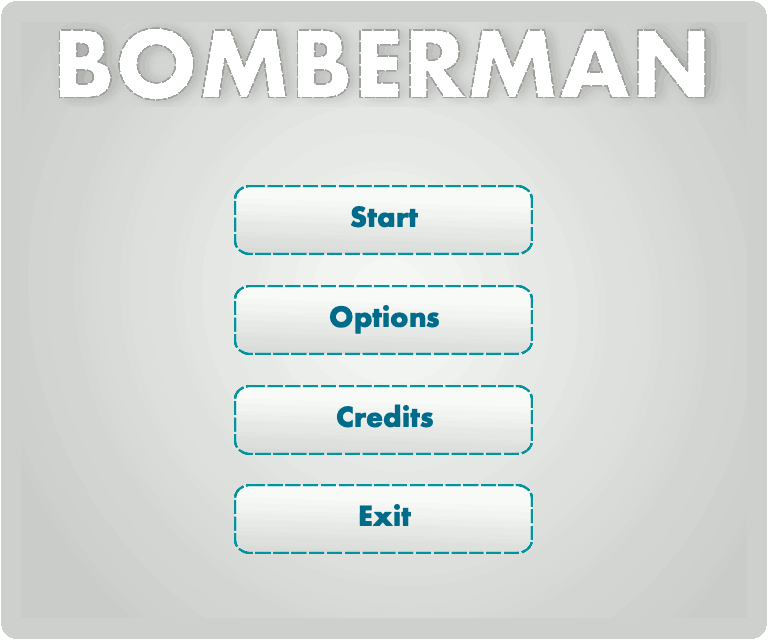

# QBomberman
Remake of Bomberman written in C++ and Qt. This is a Qt/C++ fork of the [C++ SFML Bomberman Game](https://github.com/PiGames/Bomberman).

## Screenshots

## Addons
* [Qt](https://www.qt.io/) - Cross-Platform software for embedded & desktop
* [Video](https://youtu.be/qCnIcsEiYvY) - gameplay
